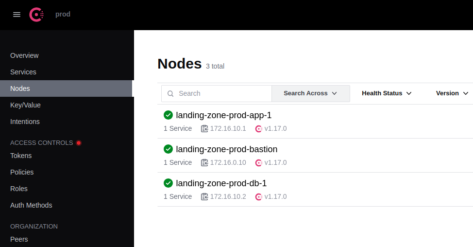

# Hetzner Cloud Landing Zone with Consul Service Mesh

This Terraform configuration creates a foundational landing zone infrastructure on Hetzner Cloud with **Consul Service Mesh**, providing a secure, observable, and well-architected base for deploying microservices and applications.

> **📝 Note**: A cloud-init syntax error was discovered and fixed in this version. See [CLOUD-INIT-FIX.md](CLOUD-INIT-FIX.md) for details. Future deployments will work correctly.

⚠️ Disclaimer: AI-Assisted Content
This CODE  was generated with the assistance of an Artificial Intelligence (AI) Large Language Model, GitHub Copilot. While the content has been reviewed for accuracy and relevance to this project, it may contain inaccuracies or variations from expected documentation standards.

## Architecture Overview

The landing zone includes:

### Network Architecture
- **Main Network**: 172.16.0.0/16 VPC with multiple subnets
  - **Management Subnet** (172.16.0.0/24): Bastion host and management tools
  - **Application Subnet** (172.16.1.0/24): Application servers and workloads
  - **Services Subnet** (172.16.2.0/24): Databases and shared services
  - **DMZ Subnet** (172.16.10.0/24): Public-facing services
- **VPN Network**: 192.168.100.0/24 for WireGuard VPN clients

### Service Mesh (NEW!)
- **Consul Server**: Centralized service registry on bastion
- **Consul Agents**: On all VMs with Envoy sidecar proxies
- **Service Discovery**: Services find each other by name, not IP
- **Automatic mTLS**: Encrypted service-to-service communication
- **Service Intentions**: Zero-trust access policies
- **Health Checking**: Automatic monitoring and failover
- **Consul UI**: Web interface at http://<bastion-ip>:8500



### Security Components
- **Bastion Host**: Secure jump host with WireGuard VPN and Consul server
- **Firewall Rules**: Three tiers of security + Consul mesh ports
  - **Bastion Firewall**: SSH, WireGuard VPN, and Consul management
  - **Application Firewall**: HTTP/HTTPS, internal SSH, and mesh traffic
  - **Database Firewall**: Restricted access only from application tier
- **SSH Key Management**: Centralized SSH key deployment
- **Fail2ban**: Automatic brute-force protection on bastion
- **Service Mesh Security**: mTLS encryption and intention-based policies

### High Availability
- **Placement Groups**: Ensures resources are spread across physical servers
  - Management placement group
  - Application placement group
  - Database placement group
- **Consul Service Mesh**: Automatic failover and load balancing

## Prerequisites

1. **Hetzner Cloud Account**: Sign up at https://console.hetzner.cloud/
2. **Terraform**: Version 1.5.0 or higher
3. **SSH Key Pair**: For accessing the infrastructure

## Quick Start

### 1. Generate SSH Key (if needed)

```bash
ssh-keygen -t ed25519 -f ./id_ed25519_hetzner_cloud_k3s -C "hetzner-landing-zone"
```

### 2. Configure Variables

```bash
# Copy the example configuration
cp terraform.tfvars.example terraform.tfvars

# Edit with your values
vim terraform.tfvars
```

Add your Hetzner Cloud API token:
```hcl
hcloud_token = "your-token-here"
```

### 3. Initialize and Deploy

```bash
# Initialize Terraform
terraform init

# Review the plan
terraform plan

# Apply the configuration
terraform apply
```

### 4. Access the Bastion

After deployment, connect to your bastion host:

```bash
# Get the SSH command from outputs
terraform output bastion_ssh_command

# Or connect directly
ssh -i ./id_ed25519_hetzner_cloud_k3s root@<bastion-ip>
```

### 5. Configure WireGuard VPN

Retrieve WireGuard configuration:

```bash
# Get WireGuard info
terraform output wireguard_info_command | sh

# Or SSH and get the config
ssh -i ./id_ed25519_hetzner_cloud_k3s root@<bastion-ip> 'cat /etc/wireguard/wg0.conf'
```

Create a client configuration:

```ini
[Interface]
PrivateKey = <generate-with-wg-genkey>
Address = 10.10.10.2/32
DNS = 1.1.1.1

[Peer]
PublicKey = <server-public-key-from-bastion>
Endpoint = <bastion-public-ip>:51820
AllowedIPs = 10.0.0.0/16, 10.10.10.0/24
PersistentKeepalive = 25
```

## 🕸️ Consul Service Mesh

The infrastructure includes Consul service mesh pre-configured:

### Quick Start

```bash
# Wait 30 seconds after terraform apply for services to register

# Check Consul status
BASTION_IP=$(terraform output -raw bastion_public_ip)
ssh admin@$BASTION_IP 'consul members'

# Configure service mesh policies
ssh admin@$BASTION_IP '/usr/local/bin/setup-consul-intentions.sh'

# Access Consul UI
terraform output consul_ui_url
# Opens: http://<bastion-ip>:8500/ui

# Use management script
./consul-manage.sh $BASTION_IP
```

### Features

- **Service Discovery**: `postgres.service.consul` instead of hardcoded IPs
- **Automatic mTLS**: All service-to-service traffic encrypted
- **Health Checks**: Unhealthy instances automatically removed
- **Zero-Trust Policies**: Explicitly allow service communication

### Service Intentions (Access Policies)

```bash
# View current policies
ssh admin@$BASTION_IP 'consul intention list'

# Allow web to connect to postgres
ssh admin@$BASTION_IP 'consul intention create -allow web postgres'

# Enable zero-trust (deny all by default)
ssh admin@$BASTION_IP 'consul intention create -deny "*" "*"'
```

### Documentation

- **CONSUL-QUICKSTART.md** - Complete guide and troubleshooting
- **MICRO-SEGMENTATION-GUIDE.md** - Option 3: Consul implementation
- **SERVICE-MESH-VMS.md** - Architecture details

## Outputs

After deployment, you'll have access to:

- `network_id`: Main network ID for deploying additional resources
- `bastion_public_ip`: Public IP of the bastion host
- `subnet_*_ip_range`: IP ranges for each subnet
- `firewall_ids`: IDs of created firewalls
- `placement_group_ids`: IDs of placement groups
- **`consul_ui_url`**: URL to access Consul web UI
- **`consul_management_commands`**: Common Consul commands
- **`service_mesh_summary`**: Overview of deployed services

## Customization

### Adjust Firewall Rules

Edit `main.tf` and modify the `hcloud_firewall` resources to match your requirements.

### Add Custom Subnets

```hcl
resource "hcloud_network_subnet" "custom" {
  type         = "cloud"
  network_id   = hcloud_network.main.id
  network_zone = var.network_zone
  ip_range     = "10.0.3.0/24"
}
```

### Change Server Types

Modify the `server_type` in the bastion resource or when creating new servers:
- `cx22`: 2 vCPU, 4 GB RAM (default)
- `cx32`: 4 vCPU, 8 GB RAM
- `cx42`: 8 vCPU, 16 GB RAM

## Security Best Practices

1. **Restrict SSH Access**: Update `allowed_ssh_ips` to your actual IP address
2. **Use WireGuard VPN**: Connect through VPN instead of exposing SSH publicly
3. **Regular Updates**: Keep the bastion host updated
4. **Key Rotation**: Regularly rotate SSH keys
5. **Enable 2FA**: Use Hetzner's 2FA for console access
6. **Audit Logs**: Regularly review access logs

## Deploying Additional Resources

Once the landing zone is deployed, you can reference its resources:

```hcl
# In another Terraform configuration
data "hcloud_network" "landing_zone" {
  name = "landing-zone-prod-network"
}

resource "hcloud_server" "app" {
  name        = "my-app"
  server_type = "cx22"
  image       = "ubuntu-24.04"
  location    = "nbg1"
  
  network {
    network_id = data.hcloud_network.landing_zone.id
    ip         = "10.0.1.10"
  }
}
```

## Cost Estimation

Approximate monthly costs:
- Bastion Host (cx22): ~€5.29/month
- Network: Free
- Firewalls: Free
- Placement Groups: Free

**Total**: ~€5.29/month for the base landing zone

## Troubleshooting

### Can't connect to bastion
- Check firewall rules in Hetzner console
- Verify your IP is in `allowed_ssh_ips`
- Ensure SSH key is correct

### WireGuard not working
- Check UFW status: `sudo ufw status`
- Verify WireGuard is running: `sudo systemctl status wg-quick@wg0`
- Check configuration: `sudo wg show`

### Resources not in private network
- Verify subnet configuration matches network zone
- Check that `network_id` references are correct

## Cleanup

To destroy all resources:

```bash
terraform destroy
```

⚠️ **Warning**: This will delete all resources created by this configuration.

## Next Steps

After deploying the landing zone:

1. Set up monitoring (Prometheus, Grafana)
2. Deploy application servers in the application subnet
3. Set up databases in the services subnet
4. Configure DNS records
5. Implement backup strategy
6. Set up CI/CD pipelines

## Resources

- [Hetzner Cloud Documentation](https://docs.hetzner.com/cloud/)
- [Terraform Hetzner Provider](https://registry.terraform.io/providers/hetznercloud/hcloud/latest/docs)
- [WireGuard Documentation](https://www.wireguard.com/quickstart/)

## License

MIT

## Support

For issues and questions:
- Hetzner Support: https://www.hetzner.com/support
- Terraform Documentation: https://www.terraform.io/docs
